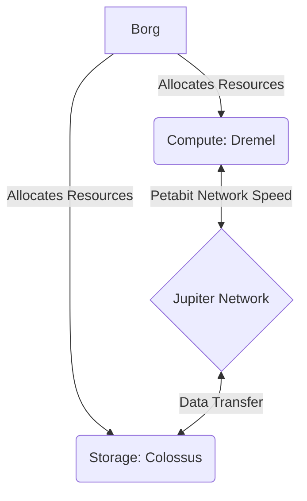
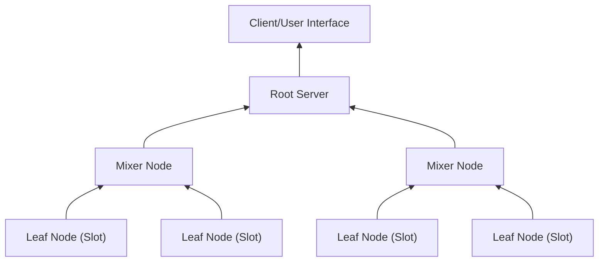

# BigQuery Deep Dive

BigQuery is not just "a database." It is a managed, serverless data warehouse built by assembling several of Google's internal heavy hitters. The secret sauce of BigQuery is the **Separation of Compute and Storage**.

This means we can store petabytes of data without paying for the CPU to process it, or spin up thousands of CPUs for a complex query without moving the data permanently.

---

### Step 1: The Four Pillars of BigQuery

Here is the high-level architecture:



#### Borg (The Cluster Manager)

Think of Borg as the **Operating System of the Data Center**. It is the grandfather of Kubernetes.

* **Role:** It manages the physical machines. It decides which server runs your query and which server holds your data.
* **Why it matters:** When you run a query, Borg instantly allocates thousands of "Slots" (virtual CPUs) to you. When you finish, it takes them back.

#### Colossus (The Storage)

Colossus is Google's global, distributed file system.

* **Role:** This is where the data actually lives. It is durable, replicated, and cheaper than disk on a standard database server.
* **Key Feature:** It handles replication and recovery automatically. If a disk fails, Colossus recovers the data from another replica without you knowing.

#### Jupiter (The Network)

Jupiter is Google's internal Petabit-scale network.

* **Role:** It connects Compute (Dremel) to Storage (Colossus).
* **The Magic:** In traditional databases, moving data over a network is slow, so we keep storage and compute on the same machine. Jupiter is *so fast* that BigQuery can read data from remote storage just as fast as if it were reading from a local hard drive.

#### Dremel (The Compute Engine)

Dremel is the query execution engine.

* **Role:** It turns your SQL into an execution tree. It splits the query into small chunks and spreads the work across thousands of servers.
* **Big Idea:** It uses a multi-level execution tree (Root, Mixers, and Leaves) to aggregate results in parallel.


#### The "Massive Restaurant" Analogy

To visualize how these interact, imagine a restaurant serving thousands of customers at once:

1. **Colossus is the Pantry:** An infinite warehouse of ingredients (Data). It's located in a separate building to save space.
2. **Borg is the Head Chef:** He doesn't cook, but he assigns stations and manages the staff. He yells, "I need 50 cooks on the dessert station now!" (Allocating Resources).
3. **Jupiter is the Conveyor Belt:** A hyper-fast system that moves ingredients from the Pantry to the Chefs in milliseconds. It ensures the chefs never wait for ingredients.
4. **Dremel represents the Line Cooks:** They take the ingredients, chop them, cook them (Process the Query), and plate the final dish.


#### Check for Understanding

1. **If Jupiter were to suddenly become as slow as a standard public internet connection, which key advantage of BigQuery would immediately fail?**
2. **Does the Dremel engine permanently "own" the hard drives where data is stored? Why or why not?**


#### Answers to Step 1 Check-in

1. **If Jupiter (Network) slowed down:** The **Separation of Compute and Storage** would fail. BigQuery relies on the network being so fast that reading remote data feels like reading from a local hard drive. If the network lags, Dremel (Compute) spends all its time waiting for Colossus (Storage), and the performance collapses.
2. **Does Dremel "own" the hard drives?** **No.** Dremel is stateless. It borrows compute power from Borg and reads data from Colossus. This allows you to shut down Dremel (stop paying for compute) while keeping your data safe in Colossus (paying cheap storage rates).

---

Now that the foundation is set, let’s look at *how* that data is actually organized.

### Step 2: Storage Depth (The 'Capacitor' Format)

Most traditional databases (like MySQL or PostgreSQL) use **Row-Oriented** storage. BigQuery uses **Column-Oriented** storage, specifically a format called **Capacitor**.

#### Row-Oriented vs. Column-Oriented

Imagine you have a table of **Employee Data**: `[ID, Name, Department, Salary]`.

* **Row-Based Storage (Traditional):**
Data is stored block-by-block, keeping a full record together.
  > `1, Alice, Sales, 5000` | `2, Bob, Eng, 8000` | `3, Charlie, Sales, 5500`


* **Pro:** Great for adding a new employee (just write one line at the end).
* **Con:** If you want to calculate the *Average Salary*, the database has to read Alice's name, department, and ID just to get to her salary. It reads **wasteful data**.


* **Column-Based Storage (BigQuery/Capacitor):**
Data is split by column and stored separately.
  > **IDs:** `1, 2, 3`
  > **Names:** `Alice, Bob, Charlie`
  > **Depts:** `Sales, Eng, Sales`
  > **Salaries:** `5000, 8000, 5500`


* **Pro:** If you run `SELECT AVG(Salary)`, BigQuery **only** reads the "Salaries" storage block. It ignores Names and Departments entirely. This drastically reduces the IO (Input/Output) cost.


####  The 'Capacitor' Secret Sauce

Capacitor isn't just column storage; it is intelligent storage. It uses heavy compression and metadata to speed things up even further.

1. **Encoding & Compression:**
    Because all data in a column is the same type (e.g., all "Department" strings), Capacitor can compress it easily.
* *Run-Length Encoding (RLE):* Instead of storing "Sales, Sales, Sales, Sales", it stores "Sales x 4". This saves massive space.


2. **Pruning (The "Zone Map"):**
Capacitor files contain a header with metadata, such as the **Min** and **Max** values for that block.
   * *Example:* If you search `WHERE Salary > 10,000`, BigQuery looks at the header of the block. If the header says "Max Salary in this block is 8,000", BigQuery **skips the entire block** without reading the data. This is called **Predicate Pushdown**.


#### The Library Analogy

Imagine a library representing your database.

* **Row-Based:** Books are organized by **Author**.
  * If you want to find "Every book with a red cover," you have to pull every single book off the shelf, look at the cover, and put it back. You touch 100% of the library.


* **Column-Based (Capacitor):** The library deconstructs the books.
  * There is a shelf containing *only* Covers.
  * There is a shelf containing *only* Titles.
  * There is a shelf containing *only* Pages.
  * To find "Red covers," you walk to the "Covers" shelf, scan them instantly (ignoring the text inside), and pick the ones you need. You touch only 10% of the data.


####  Check for Understanding

Let's see if the distinction is clear.

1. **Scenario:** You have a BigQuery table with 100 columns. You run `SELECT * FROM table` (selecting all columns). Will Columnar storage provide a performance benefit over Row-based storage in this specific case? Why or why not?
2. **Scenario:** You have a Capacitor block of data containing "Transaction Dates." The header says `{Min: 2023-01-01, Max: 2023-01-31}`. Your query asks for `WHERE date = '2023-02-15'`. What does BigQuery do with this block?

#### Answers to Step 2 Check-in

1. **Does `SELECT *` benefit from Columnar storage?** **No.** In fact, it might be slightly slower than row-based storage. Because you are asking for *every* column, BigQuery has to go to every single "shelf" (column block) and stitch the data back together to present it to you. This reconstructive work is called **tuple materialization**. Columnar storage shines when you select a *subset* of columns (e.g., `SELECT Name, Salary`).
2. **What happens with the date query?** BigQuery **skips the block entirely**. It compares your query (`2023-02-15`) against the block's header (`Max: 2023-01-31`). Since the date is outside the range, it knows the data cannot possibly be there. This is **Pruning**, and it saves you money because BigQuery charges based on the amount of data scanned.

---

### Step 3: Query Execution (The Lifecycle of a SQL Request)

Now we know where the data lives (Colossus) and how it is formatted (Capacitor). Let’s look at what happens when you actually hit "RUN."

The engine that manages this is **Dremel**. Dremel uses a "Divide and Conquer" strategy called the **Execution Tree**.

#### The Execution Tree Architecture

When a query arrives, Dremel builds a tree of workers to process it. It looks like an inverted tree structure.



**1. The Root Server (The Coordinator)**

   * **Role:** This is the entry point. It receives your SQL query.
   * **Action:** It parses the SQL, checks if you have permission to view the tables, and creates a "Query Plan." It figures out how many workers are needed and passes instructions down to the Mixers.

**2. The Mixer Nodes (The Middle Management)**

   * **Role:** These are the aggregators. They sit between the Root and the Leaves.
   * **Action:** They receive partial results from the Leaf nodes, combine them (rolling up sums, averages, or counts), and pass the refined data up to the Root. They ensure the Root isn't overwhelmed by raw data.

**3. The Leaf Nodes (The Workers / Slots)**

   * **Role:** These are the heavy lifters. This is where the **Slots** (Compute units) actually live.
   * **Action:**
     * They reach out to **Colossus** (Storage).
     * They read the specific **Capacitor** files required.
     * They perform filters and math on the raw data.
     * They send the results *up* to the Mixers.


* **Shuffle:** If a query involves a `JOIN` or `GROUP BY` that requires data to be rearranged, Leaf nodes exchange data with each other via the **Jupiter** network. This rapid data exchange is called "Shuffling."


#### The Kitchen Brigade Analogy

Let's go back to our restaurant to visualize the **Root, Mixer, and Leaf** flow. Imagine you order a complex "Seafood Platter" (The Query).

1. **The Root (Head Chef):** Receives the order ticket. He breaks it down: "We need grilled shrimp, fried calamari, and steamed crab." He doesn't cook; he delegates.
2. **The Mixers (Station Chefs - Sous Chefs):**
   * One Sous Chef takes charge of "Fried Items."
   * One Sous Chef takes charge of "Steamed Items."
   * They don't chop vegetables; they wait for the line cooks to hand them the finished components, verify the quality, and arrange them on a tray.


3. **The Leaves (Line Cooks):**
   * They run to the pantry (Colossus) to get raw shrimp.
   * They chop, batter, and fry (Filter and Process).
   * They hand the finished shrimp *up* to the Sous Chef (Mixer).


**Why this works:** If the Head Chef (Root) tried to chop every shrimp himself, the restaurant would freeze. By delegating to hundreds of Line Cooks (Leaves), they can prepare 1,000 shrimp in the same time it takes to prepare one.


#### Check for Understanding

This architecture is key to understanding BigQuery performance tuning.

1. **In a `SELECT COUNT(*)` query on a 1 Petabyte table, which node (Root, Mixer, or Leaf) is responsible for reading the actual data from the hard drive?**
2. **If you have a query with a massive `GROUP BY` operation, Dremel needs to reorganize the data so all keys (e.g., "Department = Sales") end up on the same worker. What is this data-exchange process called, and which network facilitates it?**

####  Answers to Step 3 Check-in

1. **Which node reads the data?** The **Leaf Node**. Root and Mixers *never* touch the raw data in Colossus. They only handle the aggregated results passed up from the Leaves.
2. **What is the data exchange process?** This is called **Shuffle**, and it happens over the **Jupiter** network. Because Jupiter is so fast, BigQuery can reshuffle terabytes of data between Leaf nodes in memory almost instantly.

---

### Step 4: Modern Features (Slots & The Ecosystem)

We know how BigQuery works internally. Now, let’s look at how we manage the *power* behind it and how it extends beyond simple SQL.

#### Slot Management (The Engine Power)

A **Slot** is the unit of computational capacity in BigQuery. Think of a Slot as a single Virtual CPU (vCPU) with some RAM attached.

When you run a query, BigQuery assigns slots to it.

   * **Simple Query:** Might use 50 slots.
   * **Complex Join:** Might use 2,000 slots.

**How do we buy/manage them?**

1. **On-Demand (The Default):** You pay for the *bytes processed* (how much data you scan). You get a burst of up to 2,000 slots shared among your queries.
2. **Capacity Editions (Autoscaling):** You pay for the *slot time* (compute capacity) you use.
   * **Autoscaling:** This is the modern standard. If you submit a massive query, BigQuery automatically spins up more slots (up to your limit) to handle the load. When the query finishes, those slots scale down to zero.


**The "Fair Scheduling" Architecture:**
BigQuery uses a dynamic scheduler. If you and I both submit queries at the exact same time, but I only have a small query and you have a massive one, BigQuery divides the slots fairly. It pauses a few of your "workers" to let my quick query finish, then re-assigns them back to you.

#### BigQuery Omni (Multi-Cloud)

What if your data is in AWS S3 or Azure Blob Storage? Moving it to Google Cloud is expensive (Egress fees) and slow.

**BigQuery Omni** breaks the rule that "Dremel only lives in Google Data Centers."

* Google deploys a Dremel cluster *inside* AWS or Azure (running on Kubernetes).
* You write SQL in the Google Cloud Console.
* The query plan is sent to the AWS/Azure Dremel cluster.
* It computes the result locally (next to S3/Azure Blob) and sends **only the final result** back to Google.


####  The Final Restaurant Analogy

**1. Autoscaling Slots (The Flex Staff):**
  Imagine the restaurant usually has 10 chefs. Suddenly, a busload of 100 tourists arrives.

  * **Old way:** The 10 chefs get overwhelmed, and food takes 2 hours.
  * **Autoscaling:** The manager instantly calls 20 "on-call" chefs. They work for exactly 1 hour, clear the rush, and then go home. You only pay them for that hour.

**2. BigQuery Omni (The Traveling Chef):**
You have a VIP client (AWS) who refuses to come to your restaurant; they want to eat at their own house.

  * Instead of shipping all the raw ingredients to your restaurant (expensive shipping), you send the **Chef** (Dremel) to their house. The Chef cooks there and just reports back, "Dinner was served."


#### Check for Understanding

1. **In traditional ML, you move data to the model. In BigQuery ML, does the data move to the model, or does the model move to the data? Why is this architecturally significant for a 10TB dataset?**
2. **You are using BigQuery Omni to query a 5TB file sitting in AWS S3. Do you pay AWS "Data Egress fees" for moving that 5TB file to Google Cloud?**

#### Answers to Step 4 Check-in

1. **BigQuery ML Architecture:** The **Model moves to the Data**.
      * **Significance:** For a 10TB dataset, moving the data to a Python notebook server would take hours and cost a fortune in network bandwidth. By sending the SQL instructions (the model logic) to the slots where the data already lives, the operation is immediate. This eliminates the "Data Movement Bottleneck."


2. **BigQuery Omni & Egress Fees:** **No**, you do not pay AWS Data Egress fees for the 5TB file.
      * **Why:** The Dremel engine processes the 5TB *inside* the AWS data center. It filters and aggregates the data there. It sends only the final result (perhaps a few kilobytes) back to Google. You avoid the heavy "exit tax" of moving raw data out of AWS.

That is a perfect strategy. You cannot fix a bad query if the table design is fundamentally broken. We will start with **Schema Design**, specifically **Partitioning and Clustering**, which are the two most powerful levers you have to control costs.

---

### Module 1: Schema Design (The Layout of the Data)

In BigQuery, "Scanning data" = "Spending money."
Your goal is to design tables that allow Dremel to read the **smallest amount of data possible** to answer a query. We do this through **Partitioning** and **Clustering**.

#### 1. Partitioning (The Macro Split)

Partitioning divides a large table into smaller, physical segments (partitions).

* **How it works:** You choose a column (usually a **Date/Timestamp** or an **Integer Range**) to be the "Partition Key."
* **The Physical Change:** Instead of one massive file, BigQuery stores the data in separate "buckets" behind the scenes.
* **The Benefit:** If you partition by `Transaction_Date` and run `WHERE Transaction_Date = '2024-01-01'`, BigQuery looks at the metadata, identifies the specific bucket for that day, and **completely ignores** the buckets for the other 364 days of the year.

> **Key Rule:** Partitioning is best for low-cardinality columns (columns with fewer distinct values), like Dates (365 values/year). It is *bad* for high-cardinality columns like `User_ID` (millions of values).

#### 2. Clustering (The Micro Sort)

Clustering organizes the data *inside* each partition.

* **How it works:** You choose up to 4 columns to "cluster" by (e.g., `Customer_ID`, `Region`).
* **The Physical Change:** BigQuery sorts the data based on these columns and stores similar values next to each other in the Capacitor blocks.
* **The Benefit:** Remember the **Capacitor Header** (Min/Max values)? If your data is sorted (Clustered) by `Customer_ID`, the header for Block A might say "IDs 1-100" and Block B "IDs 101-200". If you search for `Customer_ID = 150`, BigQuery instantly skips Block A.
* *Without clustering, ID 150 might be scattered across every single block, forcing BigQuery to read them all.*


#### Visualizing the Difference

Let's look at a table of **E-commerce Orders** containing 1 Year of data.

| Feature                                                 | Unpartitioned Table                     | Partitioned (by Date)                               | Partitioned & Clustered (by Date, then Customer)                            |
| ------------------------------------------------------- | --------------------------------------- | --------------------------------------------------- | --------------------------------------------------------------------------- |
| **Physical Structure**                                  | One giant pile of data.                 | 365 separate piles (one per day).                   | 365 piles. Inside each pile, data is sorted by Customer.                    |
| **Query:** `WHERE Date = 'Jan 1'`                       | Scans **365 days** (Full Table Scan). 💸 | Scans **1 day**. (Cost: 1/365th). ✅                 | Scans **1 day**.                                                            |
| **Query:** `WHERE Date = 'Jan 1' AND Customer = 'Acme'` | Scans **365 days**. 💸                   | Scans **1 day** (Reads all customers for that day). | Scans **1 day**, but **prunes specific blocks** to find 'Acme' instantly. 🚀 |


#### The Supermarket Analogy

Think of your data as products in a massive Supermarket.

**1. No Partitioning (The Chaos Store):**
All products (Milk, Bread, Shampoo, Tires) are thrown into one giant pile in the center of the store.

* *To find Milk:* You have to dig through the entire pile.

**2. Partitioning (The Aisles):**
You build aisles labeled "Dairy", "Automotive", "Bakery".

* *To find Milk:* You walk straight to the "Dairy" aisle. You ignore the "Automotive" aisle entirely.

**3. Clustering (The Shelf Organization):**
Inside the "Dairy" aisle, you organize the products logically: Yogurts together, Cheeses together, Milks together.

* *To find Milk:* You go to the Dairy aisle (Partitioning), walk to the Milk section (Clustering), and grab it. You don't browse the Yogurt section.


####  Check for Understanding

This distinction is often confused in interviews. Let's nail it.

1. **Scenario:** You have a table of `Website_Logs` (10 Petabytes). You almost always query it by **Date** (e.g., "Show me logs for yesterday"). Occasionally, you filter by **User_ID**.
   * How would you apply Partitioning?
   * How would you apply Clustering?


2. **Scenario:** You want to partition a table by `User_ID` because you have 100 million unique users and you always query by `User_ID`.
   * BigQuery has a limit of 4,000 partitions per table. Why does this design fail, and what should you do instead?


#### Answers to Module 1 Check-in

1. **Website Logs Strategy:**
   * **Partition by:** **Date** (Day). Since you "almost always" query by date, this ensures you scan only 1/365th of the data for a daily query.
   * **Cluster by:** **User_ID**. When you do filter by a specific user within that day, BigQuery will use the sorted blocks to find that user instantly, skipping the rest of the day's traffic.


2. **The User_ID Trap:**
   * **Why it fails:** You cannot create 100 million partitions. The limit is 4,000. If you try, the job will fail.
   * **The Solution:** Use **Clustering** on `User_ID`. Clustering has no limit on unique values. It will sort the 100M users intelligently within the partitions.

---

### Module 2: Query Optimization

Now that the table is designed correctly, let’s look at the query itself. When a query is slow, we don't guess; we look at the **Query Execution Plan**.

In the Google Cloud Console, after you run a query, there is a tab called **"Execution Details."** This is your X-Ray.

#### 1. The Metric that Matters: "Slot Time"

Ignore "Elapsed Time" (wall-clock time) for a moment. Look at **Slot Time Consumed**.

* **Elapsed Time:** How long you waited (e.g., 10 seconds).
* **Slot Time:** The total effort. If 100 workers worked for 10 seconds, the Slot Time is `1,000 seconds`.
* **The Insight:** If Slot Time is massive but Elapsed Time is low, your query is complex but you threw a lot of money (compute) at it. If you want to reduce costs, you must reduce Slot Time.

#### 2. The Silent Killer: Data Skew ⚖️

This is the #1 reason for distributed systems failing.

* **The Concept:** Dremel splits work among thousands of Leaf Nodes (workers). Ideally, everyone gets an equal slice.
* **The Problem:** Imagine you `GROUP BY Customer_ID`.
* Worker A gets "Customer 1" (10 rows).
* Worker B gets "Customer 2" (5 rows).
* Worker C gets "Customer NULL" (which appears 100 million times in your bad data).


* **The Result:** Workers A and B finish in milliseconds and sit idle. Worker C chugs along for 10 minutes. The query is not finished until Worker C finishes.

**How to spot Skew in the Execution Graph:**
Look at the bar charts in the Execution Details. You will see metrics for **Avg Time** and **Max Time**.

* **Healthy:** Avg Time and Max Time are close.
* **Skewed:** Avg Time is fast, but Max Time is huge. One straggler is holding up the team.

#### 3. The Bottleneck: Shuffle 🔀

As we learned, Shuffle is data moving over the Jupiter network.

* **The Rule:** Shuffle is the most expensive part of a query (both in time and slot usage).
* **Optimization:** **Filter early.**
* *Bad:* `JOIN` two massive tables, *then* filter for `Date = Today`. (You shuffled massive tables unnecessarily).
* *Good:* Filter both tables for `Date = Today` *first*, then `JOIN`. (You only shuffle the small subset).


#### The Hiking Team Analogy

Imagine a hiking team (your Workers) trying to reach the summit (The Result).

1. **Slot Time:** The total calories burned by the whole team combined.
2. **Elapsed Time:** The time the *last* person reaches the top.
3. **Data Skew:** One hiker is carrying a 100lb backpack (The "NULL" keys), while everyone else carries a lunchbox. The team cannot leave until the heavy packer arrives. The whole operation is slow because of **one** uneven distribution.


#### Check for Understanding

Let's act as a Query Doctor.

1. **Scenario:** You run a query. The **Avg** worker time is 1 second. The **Max** worker time is 2 minutes. What is the diagnosis, and what common data issue usually causes this?
2. **Scenario:** You see a query utilizing a massive amount of **Shuffle Bytes**. You notice the SQL looks like this:
```sql
SELECT *
FROM BigTable_A
JOIN BigTable_B ON A.id = B.id
WHERE A.category = 'Tech'

```

How would you rewrite this logically to reduce the Shuffle?


#### Answers to Module 2 Check-in

1. **Diagnosis: Data Skew.**
* **The Cause:** One worker is overloaded while the others are waiting. The most common culprit is a **Join Key or Group By Key heavily populated with `NULL` values** (or a default value like `-1` or `Unknown`).
* **The Fix:** Filter out the `NULL`s *before* the join or aggregation if they aren't needed.


2. **The Shuffle Fix (Filter Early):**
* **The Problem:** The database is joining *all* rows of Table A and Table B first, creating a massive intermediate table, and *then* throwing away everything that isn't 'Tech'.
* **The Fix:** Push the filter down *before* the join.
* **Revised SQL:**
```sql
WITH Filtered_A AS (
    SELECT * FROM BigTable_A WHERE category = 'Tech'
)
SELECT *
FROM Filtered_A
JOIN BigTable_B ON Filtered_A.id = BigTable_B.id

```
* *Note: Modern BigQuery is smart enough to do this automatically sometimes (Query Optimizer), but explicit filtering guarantees the performance.*

---

### Summary

We have covered the entire stack. Here is the mental model you should carry with you:

1. **The Foundation:** BigQuery separates Compute (**Dremel/Borg**) from Storage (**Colossus**), connected by a blazing fast network (**Jupiter**).
2. **The Storage:** Data is stored in **Capacitor** format (Columnar). It saves money by reading only the columns you select and pruning blocks based on headers.
3. **The Schema:** You control performance by **Partitioning** (Macro-splitting by Date) and **Clustering** (Micro-sorting by ID).
4. **The Execution:** Dremel builds a tree of **Mixers** and **Leaves**. Leaves read data; Mixers aggregate.
5. **The Optimization:** You win by reducing **Slot Time** (Efficiency) and fixing **Data Skew** (Balance).

---
